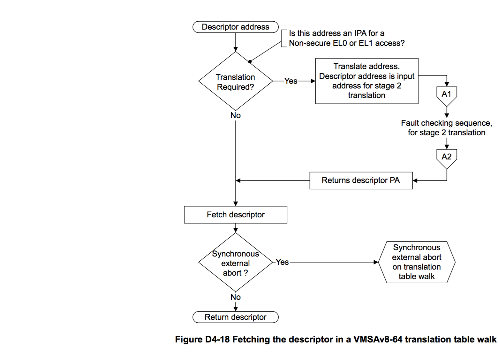

## D4.3.3 Memory attribute fields in the VMSAv8-64 translation table format descriptors

[Memory region attributes on page D4-1712](#) describes the region attribute fields. The following subsections summarize the descriptor attributes as follows:  
**Table descriptor**  
Table descriptors for stage 2 translations do not include any attribute field. For a summary of the attribute fields in a stage 1 table descriptor, that define the attributes for the next lookup level, see Next-level attributes in stage 1 VMSAv8-64 Table descriptors.  
**Block and page descriptors**  
These descriptors define memory attributes for the target block or page of memory. Stage 1 and stage 2 translations have some differences in these attributes, see:  
* Attribute fields in stage 1 VMSAv8-64 Block and Page descriptors on page D4-1700
* Attribute fields in stage 2 VMSAv8-64 Block and Page descriptors on page D4-1701.

### Next-level attributes in stage 1 VMSAv8-64 Table descriptors

In a Table descriptor for a stage 1 translation, bits[63:59] of the descriptor define the attributes for the next-level translation table access, and bits[58:52] are IGNORED:

These attributes are:

**NSTable, bit[63]**  
For memory accesses from Secure state, specifies the Security state for subsequent levels of lookup, see [Hierarchical control of Secure or Non-secure memory accesses on page D4-1703](#).
For memory accesses from Non-secure state, this bit is RES0 and is ignored by the PE. This field is RES1 in the AArch64 EL2 translation regime.

**APTable, bits[62:61]**  
Access permissions limit for subsequent levels of lookup, see [Hierarchical control of data access permissions on page D4-1706](#).  
APTable[0] is RES0:
* In the EL2 translation regime. 
* In the EL3 translation regime.

**UXNTable or XNTable, bit[60]**  
XN limit for subsequent levels of lookup, see [Hierarchical control of instruction fetching on page D4-1710](#).  
This bit is called UXNTable in the EL1&0 translation regime, where it only determines whether execution at EL0 of instructions fetched from the region identified at a lower level of lookup permitted. In the other translation regimes the bit is called XNTable.  

**PXNTable, bit[59]**  
PXN limit for subsequent levels of lookup, see [Hierarchical control of instruction fetching on page D4-1710](#).  
This bit is reserved, SBZ:
* In the EL2 translation regime.
* In the EL3 translation regime.

The definition of IGNORED means the architecture guarantees that the PE makes no use of the field, see IGNORED on page Glossary-5886. For more information about these fields see Other fields in the VMSAv8-64 translation table format descriptors on page D4-1715.

### Attribute fields in stage 1 VMSAv8-64 Block and Page descriptors

In Block and Page descriptors, the memory attributes are split into an upper block and a lower block, as shown for a stage 1 translation:

For a stage 1 descriptor, the attributes are:

**UXN or XN, bit[54]**  
The Execute-never bit. Determines whether the region is executable, see [Access permissions for instruction execution on page D4-1707](#).
This bit is called UXN (Unprivileged execute never) in the EL1&0 translation regime, where it only determines whether execution at EL0 of instructions fetched from the region is permitted. In the other translation regimes the bit is called XN (Execute never).

**PXN, bit[53]**
The Privileged execute-never bit. Determines whether the region is executable at EL1, see Access permissions for instruction execution on page D4-1707.
This bit is RES0 in the EL2 and EL3 translation regimes.

**Contiguous, bit[52]**
A hint bit indicating that the translation table entry is one of a contiguous set or entries, that might be cached in a single TLB entry, see The Contiguous bit on page D4-1715.

**nG, bit[11]**
The not global bit. Determines whether the TLB entry applies to all ASID values, or only to the current ASID value, see Global and process-specific translation table entries on page D4-1730.
Valid only to the EL1&0 translation regime. This bit is RES0 in all other translation regimes.

**AF, bit[10]**
The Access flag, see The Access flag on page D4-1711.

**SH, bits[9:8]**  
Shareability field, see Memory region attributes on page D4-1712. AP[2:1], bits[7:6]

**NS, bit[5]**
Data Access Permissions bits, see Memory access control on page D4-1704. Note
The ARMv8 translation table descriptor format defines AP[2:1] as the Access Permissions bits, and does not define an AP[0] bit.
AP[1] is valid only to the EL1&0 translation regime, and is RES1 in all other translation regimes.
Non-secure bit. For memory accesses from Secure state, specifies whether the output address is in the Secure or Non-secure address map, see Control of Secure or Non-secure memory access on page D4-1702.
For memory accesses from Non-secure state, this bit is RES0 and is ignored by the PE. This field is RES1 in the AArch64 EL2 translation regime.
AttrIndx[2:0], bits[4:2]
Stage 1 memory attributes index field, for the MAIR_ELx, see Memory region type and attributes, for stage 1 translations on page D4-1712.

