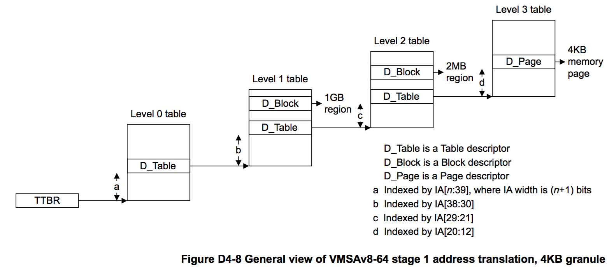
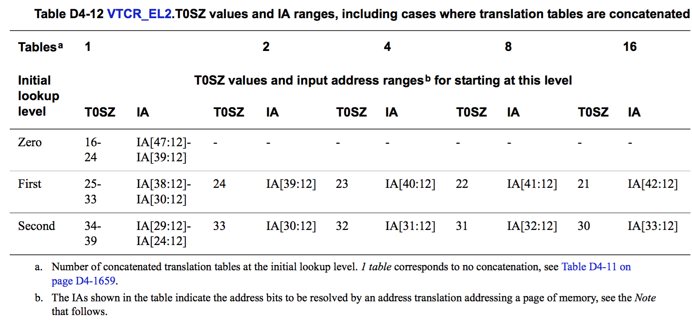
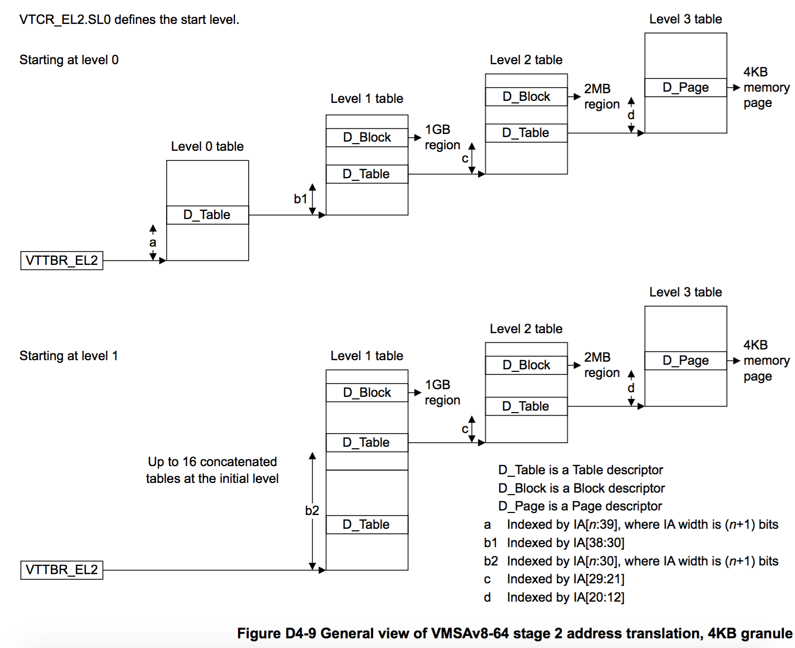
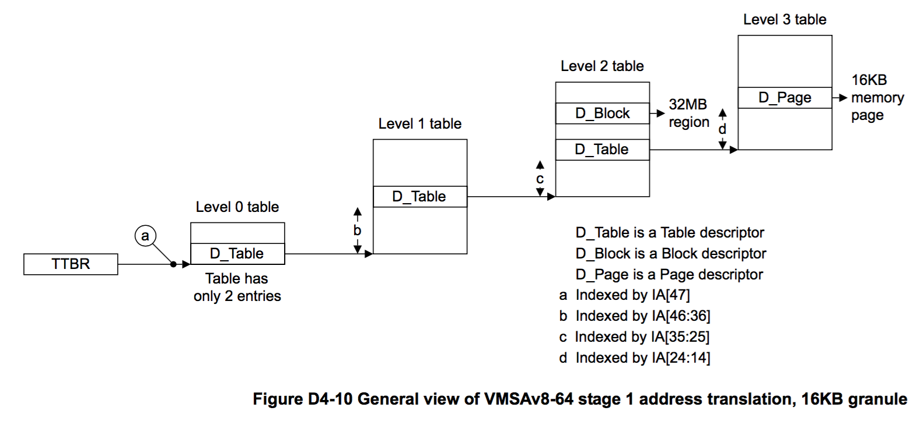
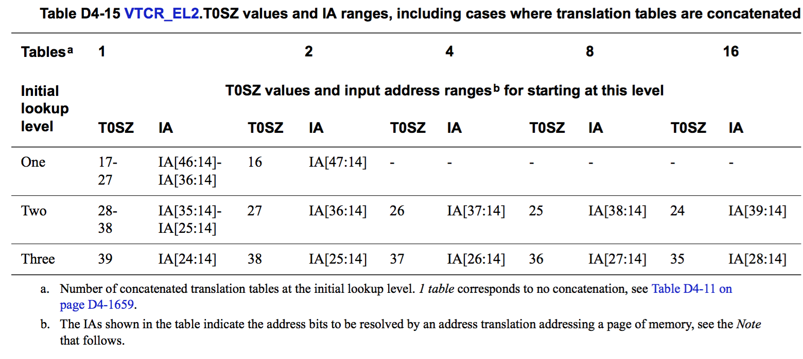
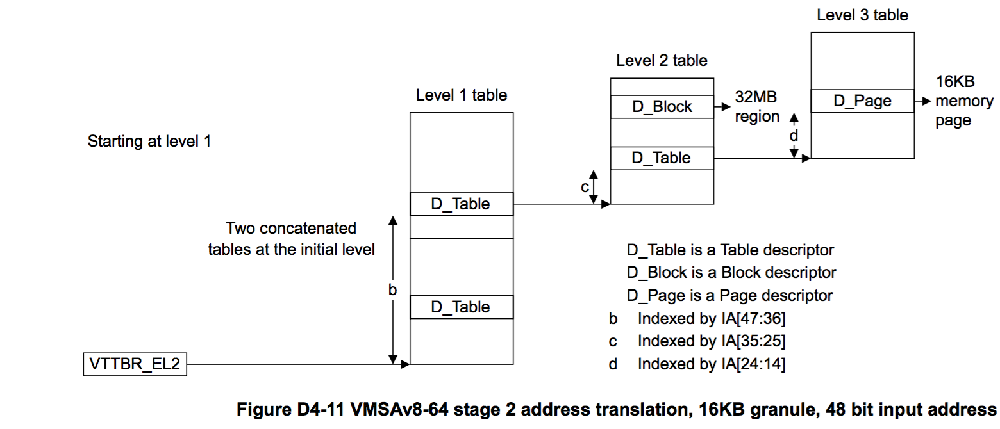
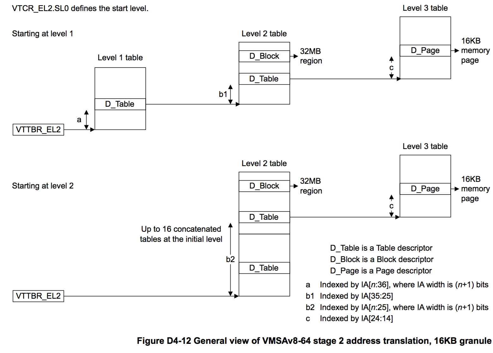
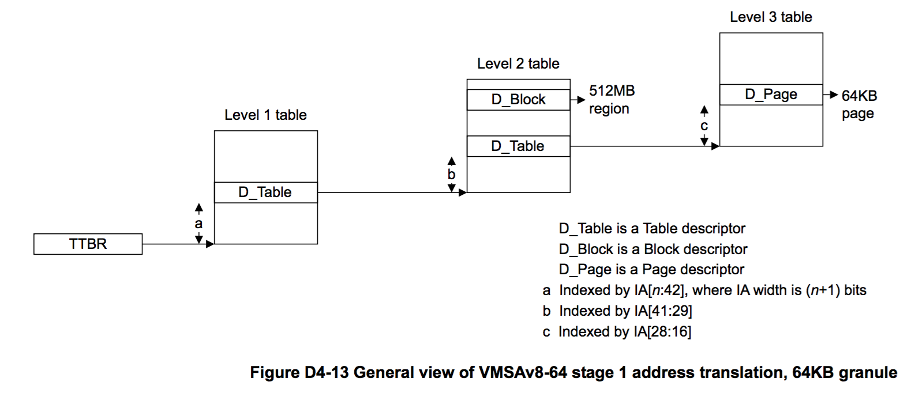

## D4.2.5 Overview of the VMSAv8-64 address translation stages

[Memory translation granule size](#) 章节介绍了不同的 granule size 对地址转换过程中的影响。[Effect of granule size on translation table addressing and indexing on page D4-1654](#) 章节则介绍了，各个 granule size 下：
* 输入地址的范围与第一次 lookup 所在 level 的关系。
* stage 2 转换过程中的 [Concatenated translation tables](#)。
* TTBR 中第一次 lookup 的 translation table 的基地址的存储方式。

本小节中，将汇总不同 granule size 对地址转换过程中的 1 个 stage 中的 lookup 的影响，主要包括以下内容：

* [Overview of VMSAv8-64 address translation using the 4KB translation granule on page D4-1659](#)。 
* [Overview of VMSAv8-64 address translation using the 16KB translation granule on page D4-1662](#)。 
* [Overview of VMSAv8-64 address translation using the 64KB translation granule on page D4-1665](#)。 

### Overview of VMSAv8-64 address translation using the 4KB translation granule

The requirements for the level of the initial lookup are different for stage 1 and stage 2 translations.

stage 1 和 stage 2 的地址转换的第一次 lookup 所在的 level 有所差异。

#### Overview of stage 1 translations, 4KB granule

在 stage 1 地址转换中，第一次 lookup 所在的 level 由 TCR.TxSZ 寄存器位所设定的输入地址范围唯一决定。具体的关系如 Table D4-11 所示：

上面的配置关系对于 stage 2 的地址转换同样适用。

> **NOTE:**  
* 当使用 4KB translation granule 时，第一次 lookup 不会在 level 3。
* IA 的一些地址位不需要通过 translation table lookup 来解析，它们是直接映射到 OA 中，例如，在 4KB translation granule 中，所有转换中 IA[11:0] = OA[11:0]。

Figure D4-8 中描述了使用 4KB translation granule、输入地址大于 39 位时的 stage 1 地址转换过程。 

#### Overview of stage 2 translations, 4KB granule

For a stage 2 translation, up to 16 translation tables can be concatenated at the initial lookup level. For certain input address sizes, concatenating tables in this way means that the lookup starts at a lower level than would otherwise be the case. For more information see [Concatenated translation tables for the initial stage 2 lookup on page D4-1671.](#)

在 stage 2 地址转换中，第一次 lookup 的 translation table 最多可以由 16 个 translation table 连接起来。(译者注：连接的 table 越多，单次 lookup 可以解析的地址位就越多。) 

When using the 4KB translation granule, Table D4-12 shows all possibilities for the initial lookup for a stage 2 translation.

> **NOTE:**
* When using the 4KB translation granule, the initial lookup cannot be at level 3.
* Because concatenating translation tables reduces the number of levels of lookup required, when using the 4KB translation granule, tables cannot be concatenated at level 0.
* Some bits of the IA do not require resolution by the translation table lookup, because they always map directly to the OA. When using the 4KB translation granule, IA[11:0] = OA[11:0] for all translations.

In addition, VTCR_EL2.SL0 indicates the required initial lookup level, as Table D4-13 shows.

Because the maximum number of concatenated translation tables is 16, there is a relationship between the permitted VTCR_EL2.{T0SZ, SL0} values. If, when a translation table walk is started, the T0SZ value is not consistent with the SL0 value, a stage 2 level 0 translation fault is generated.

Figure D4-9 shows the stage 2 address translation, for an input address size of between 40 and 43 bits. For an input address size in this range, the lookup can start at either level 0 or level 1.

### Overview of VMSAv8-64 address translation using the 16KB translation granule

The requirements for the level of the initial lookup are different for stage 1 and stage 2 translations.

#### Overview of stage 1 translations, 16KB granule

For a stage 1 translation, the required initial lookup level is determined only by the required input address range specified by the corresponding TCR.TxSZ field. When using the 16KB translation granule, Table D4-14 shows this requirement.

The configuration options for an initial lookup at level 1, level 2, or level 3 are also permitted for stage 2 translations, but stage 2 translation does not permit an initial lookup at level 0.

> **NOTE:**
* When using the 16KB translation granule, a maximum of 1 bit of IA is resolved by a level 0 lookup.
* Some bits of the IA do not require resolution by the translation table lookup, because they always map directly to the OA, When using the 16KB translation granule, IA[13:0] = OA[13:0] for all translations.

Figure D4-10 shows the stage 1 address translation, for an address translation using the 16KB granule with an input address size of 48 bits.

#### Overview of stage 2 translations, 16KB granule

For a stage 2 translation, up to 16 translation tables can be concatenated at the initial lookup level. For certain input address sizes, concatenating tables in this way means that the lookup starts at a lower level than would otherwise be the case. For more information see Concatenated translation tables for the initial stage 2 lookup on page D4-1671.
When using the 16KB granule, for a stage 2 translation with an input address sized of 48 bits, the initial lookup must be at level 1, with two concatenated translation tables at this level.
When using the 16KB translation granule, Table D4-15 shows all possibilities for the initial lookup for a stage 2 translation.

> **NOTE:**
* When using the 16KB translation granule for a stage 2 translation, the initial lookup cannot be at level 0. When a 48-bit input address is required, translation must start with a level 1 lookup using two concatenated translation tables.
* Some bits of the IA do not require resolution by the translation table lookup, because they always map directly to the OA. When using the 16KB translation granule, IA[13:0] = OA[13:0] for all translations.

In addition, VTCR_EL2.SL0 indicates the required initial lookup level, as Table D4-16 shows.

Because the maximum number of concatenated translation tables is 16, there is a relationship between the permitted VTCR_EL2.{T0SZ, SL0} values. If, when a translation table walk is started, the T0SZ value is not consistent with the SL0 value, a stage 2 level 0 translation fault is generated.
When stage 2 translation supports a 48-bit input address range, translation must start with a level 1 lookup using two concatenated translation tables. Figure D4-11 shows the translation for this case.

However, for an input address size of between 37 and 40 bits, Table D4-15 on page D4-1663 shows that translation can start with either a level 1 lookup or a level 2 lookup, and Figure D4-12 shows these options.

### Overview of VMSAv8-64 address translation using the 64KB translation granule

The requirements for the level of the initial lookup are different for stage 1 and stage 2 translations.

#### Overview of stage 1 translations, 64KB granule

For a stage 1 translation, the required initial lookup level is determined only by the required input address range specified by the corresponding TCR.TxSZ field. When using the 64KB translation granule, Table D4-17 shows this requirement.

These configuration options are also permitted for stage 2 translations.

> **NOTE:**
* When using the 64KB translation granule, there are no level 0 lookups.
* Some bits of the IA do not require resolution by the translation table lookup, because they always map directly to the OA. When using the 64KB translation granule, IA[15:0] = OA[15:0] for all translations.

Figure D4-13 shows the stage 1 address translation, for an address translation using the 64KB granule with a an input address size greater than 42 bits.

#### Overview of stage 2 translations, 64KB granule

For a stage 2 translation, up to 16 translation tables can be concatenated at the initial lookup level. For certain input address sizes, concatenating tables in this way means that the lookup starts at a lower level than would otherwise be the case. For more information see Concatenated translation tables for the initial stage 2 lookup on page D4-1671.
When using the 64KB translation granule, Table D4-18 shows all possibilities for the initial lookup for a stage 2 translation.

> **NOTE:**

* When using the 64KB translation granule, there are no level 0 lookups.
* Because concatenating translation tables reduces the number of levels of lookup required, when using the 64KB translation granule, tables cannot be concatenated at level 1.
* Some bits of the IA do not require resolution by the translation table lookup, because they always map directly to the OA. When using the 64KB translation granule, IA[15:0] = OA[15:0] for all translations.

VTCR_EL2.SL0 indicates the required initial lookup level, as Table D4-19 shows.

Because the maximum number of concatenated translation tables is 16, there is a relationship between the permitted VTCR_EL2.{T0SZ, SL0} values. If, when a translation table walk is started, the T0SZ value is not consistent with the SL0 value, a stage 2 level 0 translation fault is generated.

Figure D4-14 shows the stage 2 address translation, for an input address size of between 43 and 46 bits. This means the lookup can start at either level 1 or level 2.

