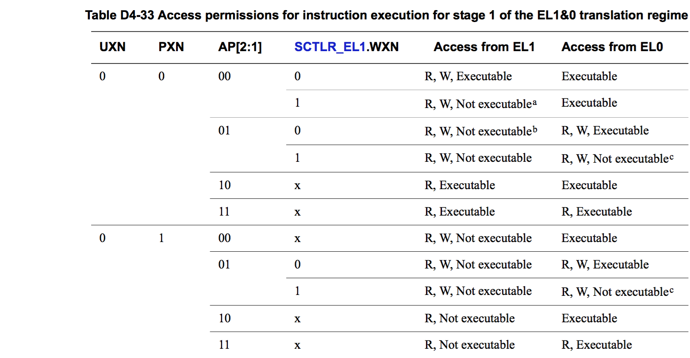
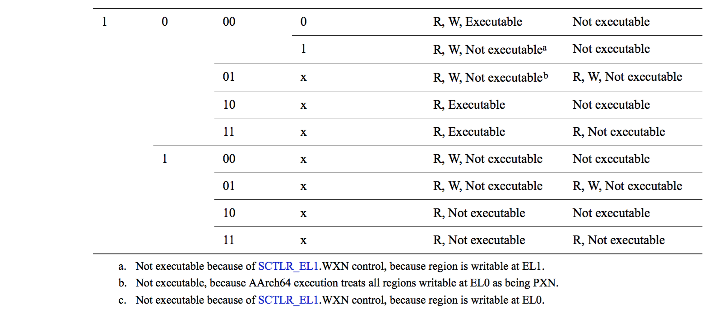
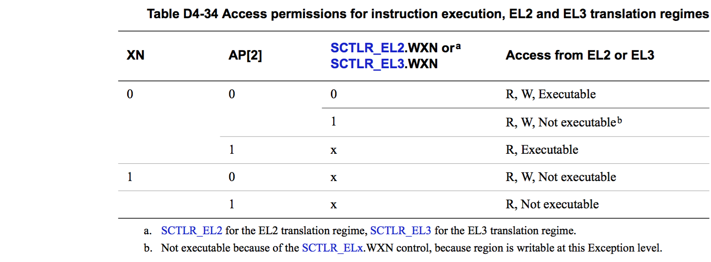

## D4.4.1 Memory access control

Translation table descriptors 中的 access control fields 决定了 PE 在当前 state 下，是否可以访问 translation table descriptor 中的 output address 所指向的内存。如果一个 translation stage 中，如果出现不允许访问时，就会产生一个 MMU fault，禁止该内存访问操作。

* [About the access permissions](#).
* [The data access permission controls](#).
* [Access permissions for instruction execution](#).
* [The Access flag](#).

### About the access permissions

> **NOTE:**
> 本小节主要描述 memory access permissions。在包含 EL2 具体实现中，运行在 EL1 Non-secure state 的软件只能感知到 Non-secure EL1&0 stage 1 translations 中定义的 access permissions。运行在 EL2 上软件则可以修改这些 permissions，EL2 上对 permissions 的修改对于运行在 EL1/EL0 Non-secure state 的软件是透明的。

The access permission bits control access to the corresponding memory region. The VMSAv8-64 translation table format:

Access permission bits 控制对相应 memory region 的访问。在 VMSAv8-64 translation table format 中：

* 在 stage 1 translations 中， AP[2:1] 定义了 data access permissions，详细的定义参考 [The AP[2:1] data access permissions, for stage 1 translations](#) 小节。
* 在 stage 2 translations 中， S2AP[1:0] 定义了 data access permissions，详细的定义参考 [The S2AP data access permissions, Non-secure EL1&0 translation regime](#) 小节。
* UXN，XN 和 PXN bits 定义了 instruction fetches 过程中的 access permissions，详细的定义参考 [Access permissions for instruction execution](#) 小节。

尝试进行 translation table 中的 access permission bits 所禁止的内存访问将会在相应的 translation stage  产生 Permission fault。
> **NOTE: **  
> 在包含 EL2 的具体实现中，Non-secure EL1 or EL0 的俩个不同的 translation stage 中有其独立的 permission check。

### The data access permission controls

后续的几个小节主要描述 data access permission controls:

* [The AP[2:1] data access permissions, for stage 1 translations](#).
* [The S2AP data access permissions, Non-secure EL1&0 translation regime](#).
* [Hierarchical control of data access permissions](#).

**The AP[2:1] data access permissions, for stage 1 translations**  
For the VMSAv8-64 EL1&0 translation regime, the AP[2:1] bits control the stage 1 data access permissions, and:  
在 VMSAv8-64 EL1&0 translation regime 中，AP[2:1] bits 控制 stage 1 的 data access permissions：

**AP[2]** Selects between read-only and read/write access.  
**AP[1]** Selects between Application level (EL0) and System level (EL1) control.  

上述两个 bits 提供了四种可能的 data access permission 设定：

* Read-only at all levels.
* Read/write at all levels.
* Read-only at EL1, no access by software executing at EL0.
* Read/write at EL1, no access by software executing at EL0.

对于  EL1&0 translation regimes 以外的 translation regimes，AP[2] 决定了 stage 1 的 data access permissions，AP[1] 则为：

* SBO.
* Ignored by hardware and is treated as if it is 1.

Table D4-29 描述了 EL1&0 translation regime stage 1 的 data access permission bits 的配置。在该表中，值为 None 时，意味着任何访问会在对应的 Exception level 中触发 faults。

对于 Non-secure EL1&0 translation regime:
* Stage 2 translation 也定义了 data access permissions, 详细定义参考 [The S2AP data access permissions, Non-secure EL1&0 translation regime](#) 章节。
* [Combining the stage 1 and stage 2 data access permissions](#) 章节介绍了当两个 translation stages 都使能时，data access permission 的合并规则。

Table D4-30 描述了 EL2 and EL3 translation regimes 中 AP[2] data access permission bit 的配置情况。

**The S2AP data access permissions, Non-secure EL1&0 translation regime**  
In the Non-secure EL1&0 translation regime, when stage 2 address translation is enabled, the S2AP field in the stage 2 translation table descriptors define the data access permissions as Table D4-31 shows. In this table, an entry of None indicates that any access generates a permission fault.
Table D4-31 描述了 Non-secure EL1&0 translation regime 中，使能 stage 2 address translation 后，stage 2 translation table descriptors 中的 S2AP bits 对 data access permission 的设定。在该表中，值为 None 时，意味着任何访问会触发 permission faults。

The S2AP access permissions make no distinction between Non-secure accesses from EL1 and Non-secure accesses from EL0. However, when both stages of address translation are enabled, these permissions are combined with the stage 1 access permissions defined by AP[2:1], see [Combining the stage 1 and stage 2 data access permissions on page D4-1717](#).  
[Combining the stage 1 and stage 2 attributes, Non-secure EL1&0 translation regime on page D4-1717](#) gives more information about the use of the stage 1 and stage 2 access permissions in an implementation of virtualization.

**Hierarchical control of data access permissions**  

The VMSAv8-64 translation table format includes mechanisms by which entries at one level of translation table lookup can set limits on the permitted entries at subsequent levels of lookup. This subsection describes how these controls apply to the data access permissions.  

> **NOTE: **  
> Similar hierarchical controls apply to instruction fetching, see [Hierarchical control of instruction fetching on page D4-1710](#).  

The restrictions apply only to subsequent levels of lookup for the same stage of translation. The APTable[1:0] field restricts the access permissions, as Table D4-32 shows.  

As stated in the table footnote, for the EL2 translation regime, APTable[0] is reserved, SBZ, and is ignored by the hardware.

> **NOTE:**  
The APTable[1:0] settings are combined with the translation table access permissions in the translation tables descriptors accessed in subsequent levels of lookup. They do not restrict or change the values entered in those descriptors.  

The VMSAv8-64 provides APTable[1:0] control only for the stage 1 translations. The corresponding bits are SBZ in the stage 2 translation table descriptors.  

The effect of APTable applies to later entries in the translation table walk, and so its effects can be held in one or more TLB entries. Therefore, a change to APTable requires coarse-grained invalidation of the TLB to ensure that the effect of the change is visible to subsequent memory transactions.

### Access permissions for instruction execution

Execute-never (XN) controls determine whether instructions can be executed from a memory region. These controls are:  

**UXN, Unprivileged Execute never**  
  Defined only for stage 1 of the EL1&0 translation regime.  

**PXN, Privileged execute never**  
  Used only for stage 1 of the EL1&0 translation regime:  

   * For the EL2 and EL3 translation regimes, the descriptors define a PXN bit that is reserved, SBZ, and is ignored by hardware.
   * For stage 2 of the Non-secure EL1&0 translation regime, the corresponding bit position is reserved, SBZ, and is ignored by hardware.

**XN, Execute never**  
Defined for stage 2 of the EL1&0 translation regime and for stage 1 of the EL2 and EL3 translation regimes.  

Each of theses bits is set to 1 to indicate that instructions cannot be executed from the target memory region. In addition:

* For the EL1&0 translation regime, if the value of the AP[2:1] bits is 0b01, permitting write access from EL0, then the PXN bit is treated as if it has the value 1, regardless of its actual value.
* For each translation regime, if the value of the corresponding SCTLR_ELx.WXN bit is 1 then any memory region that is writable is treated as XN, regardless of the value of the corresponding UXN, XN, or PXN bit. For more information see [Preventing execution from writable locations on page D4-1711](#).
* The SCR_EL3.SIF bit prevents execution in Secure state of any instruction fetched from Non-secure memory, see [Restriction on Secure instruction fetch on page D4-1711](#).

The execute-never controls apply to speculative instruction fetching, meaning speculative instruction fetch from a memory region that is execute-never at the current Exception level is prohibited.

> **NOTE: **  
* Although the execute-never controls apply to speculative fetching, on a speculative instruction fetch from an execute-never location, no Permission fault is generated unless the PE attempts to execute the instruction that would have been fetched from that location. This means that, if a speculative fetch from an execute-never location is attempted, but there is no attempt to execute the corresponding instruction, a Permission fault is not generated.
* The software that defines a translation table must mark any region of memory that is read-sensitive as execute-never, to avoid the possibility of a speculative fetch accessing the memory region. This means it must mark any memory region that corresponds to a read-sensitive peripheral as execute-never. Hardware does not prevent speculative accesses to a region of any Device memory type unless that region is also marked as execute-never for all Exception levels from which it can be accessed.
* When no stage of address translation for the translation regime is enabled, memory regions cannot have UXN, XN, or PXN attributes assigned. [Behavior of instruction fetches when all associated stages of translation are disabled on page D4-1679](#) describes how disabling all stages of address translation affects instruction fetching.

The following subsubsections describe the data access permission controls:

* [Instruction access and execution permissions for stage 1 translations](#).
* [Instruction execution permissions for stage 2 translations on page D4-1710](#).
* [Hierarchical control of instruction fetching on page D4-1710](#).
* [Preventing execution from writable locations on page D4-1711](#).
* [Restriction on Secure instruction fetch on page D4-1711](#).

**Instruction access and execution permissions for stage 1 translations**  
Table D4-33 and Table D4-34 on page D4-1709 include the AP[2:1] read and write permissions shown in Table D4-29 on page D4-1705 and Table D4-30 on page D4-1706. These permissions are shown as:  
**R** Indicates Read permission granted.   
**W** Indicates Write permission granted.  
Table D4-33 shows the access permissions for instruction execution for stage 1 of the EL1&0 translation regime.

Table D4-34 shows the access permissions for instruction execution for the EL2 and EL3 translation regimes.

> **NOTE: **  
> The Access permissions for the AArch64 EL2 and EL3 translation regimes are consistent with the following fields in the translation table entries being treated as shown:  
* AP[1] treated as RES1. 
* APTable treated as RES0. 
* PXN treated as RES0. 
* PXNTable treated as RES0.

**Instruction execution permissions for stage 2 translations**  

For the Non-secure EL1&0 stage 2 translation, the XN bit in the stage 2 translation table descriptors controls the execution permission, and this control is completely independent of the S2AP access permissions.

The stage 2 XN access permissions make no distinction between Non-secure accesses from EL1 and Non-secure accesses from EL0. However, when both stages of address translation are enabled, these permissions are combined with the stage 1 access permissions defined at stage 1 of the translation, see Combining the stage 1 and stage 2 instruction execution permissions on page D4-1718.

**Hierarchical control of instruction fetching**  

The VMSAv8-64 translation table format includes mechanisms by which entries at one level of translation table lookup can set limits on the permitted entries at subsequent levels of lookup. This subsection describes how these controls apply to the instruction fetching controls.

> **NOTE: **  
Similar hierarchical controls apply to data accesses, see Hierarchical control of data access permissions on page D4-1706.

The restrictions apply only to subsequent levels of lookup at the same stage of translation, and:

* UXNTable or XNTable restricts the XN control:
   - When the value of the XNTable bit is 1, the XN bit is treated as 1 in all subsequent levels of lookup, regardless of its actual value.
   - When the value of the UXNTable bit is 1, the UXN bit is treated as 1 in all subsequent levels of lookup, regardless of its actual value.
   - When the value of a UXNTable or XNTable bit is 0 the bit has no effect.
* For the EL1&0 translation regime, PXNTable restricts the PXN control:
   - When PXNTable is set to 1, the PXN bit is treated as 1 in all subsequent levels of lookup, regardless of the actual value of the bit.
   - When PXNTable is set to 0 it has no effect.

> **NOTE: **
The UXNTable, XNTable, and PXNTable settings are combined with the UXN, XN, and PXN bits in the translation table descriptors accessed at subsequent levels of lookup. They do not restrict or change the values entered in those descriptors.  

The UXNTable, XNTable, and PXNTable controls are provided only for stage 1 translations. The corresponding bits are SBZ in the stage 2 translation table descriptors.  

The effect of UXNTable, XNTable, or PXNTable applies to later entries in the translation table walk, and so its effects can be held in one or more TLB entries. Therefore, a change to UXNTable, XNTable, or PXNTable requires coarse-grained invalidation of the TLB to ensure that the effect of the change is visible to subsequent memory transactions.

**Preventing execution from writable locations**

ARMv8 provides control bits that, when corresponding stage 1 address translation is enabled, force writable memory to be treated as UXN, PXN, or XN, regardless of the value of the UXN, PXN, or XN bit:

* For the EL1&0 translation regime, when the value of SCTLR_EL1.WXN is 1:
   - All regions that are writable from EL0 at stage 1 of the address translation are treated as UXN.
   - All regions that are writable from EL1 at stage 1 of the address translation are treated as PXN
* For the EL2 translation regime, when the value of SCTLR_EL2.WXN is 1, all regions that are writable at stage 1 of the address translation are treated as XN.
* For the EL3 translation regime, when the value of SCTLR_EL3.WXN is 1, all regions that are writable at stage 1 of the address translation are treated as XN.

> **NOTE: **  
* The SCTLR_ELx.WXN controls are intended to be used in systems with very high security requirements.
* Setting a WXN bit to 1 changes the interpretation of the translation table entry, overriding a zero value of a UXN, XN, or PXN field. It does not cause any change to the translation table entry.

For any given virtual machine, ARM expects WXN to remain static in normal operation. In particular, it is IMPLEMENTATION DEFINED whether TLB entries associated with a particular VMID reflect the effect of the values of these bits. This means that any change of these bits without a corresponding change of VMID might require synchronization and TLB invalidation, as described in TLB maintenance requirements and the TLB maintenance instructions on page D4-1733.

**Restriction on Secure instruction fetch**  

EL3 provides a Secure instruction fetch bit, SCR_EL3.SIF. When the value of this bit is 1, and execution is using the EL3 translation regime or the Secure EL1 translation regime, any attempt to execute an instruction fetched from Non-secure physical memory causes a Permission fault. TLB entries might reflect the value of this bit, and therefore any change to the value of this bit requires synchronization and TLB invalidation, as described in TLB maintenance requirements and the TLB maintenance instructions on page D4-1733.

### The Access flag

The Access flag indicates when a page or section of memory is accessed for the first time since the Access flag in the corresponding translation table descriptor was set to 0.
The AF bit in the translation table descriptors is the Access flag.

**Software management of the Access flag**  

ARMv8 requires that software manages the Access flag. This means an Access flag fault is generated whenever an attempt is made to read into the TLB a translation table descriptor entry for which the value of Access flag is 0.

The Access flag mechanism expects that, when an Access flag fault occurs, software resets the Access flag to 1 in the translation table entry that caused the fault. This prevents the fault occurring the next time that memory location is accessed. Entries with the Access flag set to 0 are never held in the TLB, meaning software does not have to flush the entry from the TLB after setting the flag.

> **NOTE: **  
If a system incorporates a System MMU that implements the ARM SMMUv3 architecture and software shares translation tables between the ARM PE and the SMMUv3, then the software must be aware of the possibility that the System MMU update the access flag in hardware.  
In such a system, system software should perform any changes of translation table entries with an Access flag of 0, other than changes to the Access flag value, by using an Load-Exclusive/Store-Exclusive loop, to allow for the possibility of simultaneous updates.
